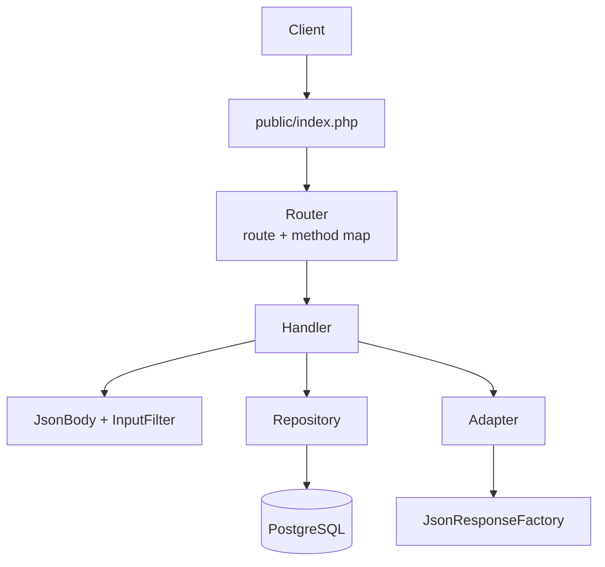

# laminas-api-sample

A learning project in PHP 8.5, Laminas and Doctrine: a small REST backend
modelled on a slice of the
[Path of Exile developer API](https://www.pathofexile.com/developer/docs/reference).
Paths, response shapes and error codes follow the published docs, but it
serves its own data and never calls GGG's API.

The app is hand-wired from Laminas components rather than built from a
skeleton, so each part can be understood and explained. The commit history
follows that progression.

This project isn't affiliated with or endorsed by Grinding Gear Games in any way.


## Features

- `GET /profile`, `GET|POST /item-filter`, `GET|POST /item-filter/{id}`, with
  documented response shapes
- Create and partial update, validated with `laminas-inputfilter`, including
  the rule that a public filter can't be made private
- Documented error body `{"error": {"code", "message"}}`, with 405 + `Allow`
  from per-route method maps
- Doctrine entities, embeddables, UUID ids and reviewed migrations
- Fixtures seeded from real item filter files
- Mago formatting, linting and strict static analysis

## Roadmap

- PHPUnit tests and GitHub Actions CI
- Nginx + php-fpm in Docker Compose
- Mocked OAuth bearer tokens with per-route scopes and ownership
- OpenAPI spec with Swagger UI
- Per-token rate limiting in Redis, with the documented headers

## How it works



## Build and run

Requires PHP 8.5 with `pdo_pgsql`, Composer and Docker.

```bash
git clone https://github.com/blakesimpson-dev/laminas-api-sample.git
cd laminas-api-sample
composer install
cp .env.example .env    # set DB_NAME, DB_USER, DB_PASSWORD
composer db:reset       # Postgres + migrations
composer fixtures:load
composer serve          # http://localhost:8080
```

| Script | Purpose |
|--------|---------|
| `composer serve` | PHP built-in server on port 8080 |
| `composer format:check` / `lint` / `analyze` | Mago |
| `composer migrations:diff` / `migrations:migrate` | Doctrine Migrations |
| `composer fixtures:load` | Purge and reseed |
| `composer db:reset` | Recreate Postgres and migrate |

## Layout

| Path | Purpose |
|------|---------|
| `public/index.php` | Front controller |
| `bootstrap.php` | Autoload and validated `.env` |
| `config` | Routes, service manager, Doctrine |
| `src/Http` | Router, request parsing, responses |
| `src/Domains` | One folder per domain: entity, repository, adapter, handlers, validation, provider |
| `docs` | README demo (`demo.tape` records `demo.gif` with VHS) |
| `bin` | Migration and fixture runners |
| `migrations` | Doctrine migrations |
| `test/Fixtures` | Fixtures and filter files |

## Dependencies

| Dependency | Version | Licence |
|------------|---------|---------|
| laminas router, servicemanager, http | 3.19, 3.24, 2.23 | BSD-3-Clause |
| laminas inputfilter, validator | 2.35, 2.65 | BSD-3-Clause |
| doctrine orm, migrations, data-fixtures | 3.7, 3.9, 2.2 | MIT |
| roave/psr-container-doctrine | 6.2 | BSD-2-Clause |
| ramsey/uuid | 4.9 | MIT |
| vlucas/phpdotenv | 5.7 | BSD-3-Clause |
| PostgreSQL (Docker) | 17 | PostgreSQL |
| Mago (dev) | 1.50 | MIT / Apache-2.0 |

## Credits

Item filter fixtures are
[NeverSink's filters](https://github.com/NeverSinkDev/NeverSink-Filter)
(MIT), exported from FilterBlade.

The application code is my own (MIT, see [LICENSE](LICENSE)); an LLM was used
for explanations and tooling configuration.

## References

- [Path of Exile developer docs](https://www.pathofexile.com/developer/docs)
- [Laminas](https://docs.laminas.dev/),
  [mezzio-skeleton](https://github.com/mezzio/mezzio-skeleton)
- [Doctrine ORM](https://www.doctrine-project.org/projects/orm.html),
  [Migrations](https://www.doctrine-project.org/projects/migrations.html),
  [Data Fixtures](https://www.doctrine-project.org/projects/data-fixtures.html)
- [PER Coding Style](https://www.php-fig.org/per/coding-style/),
  [PSR-4](https://www.php-fig.org/psr/psr-4/)
- [Mago](https://mago.carthage.software/)
