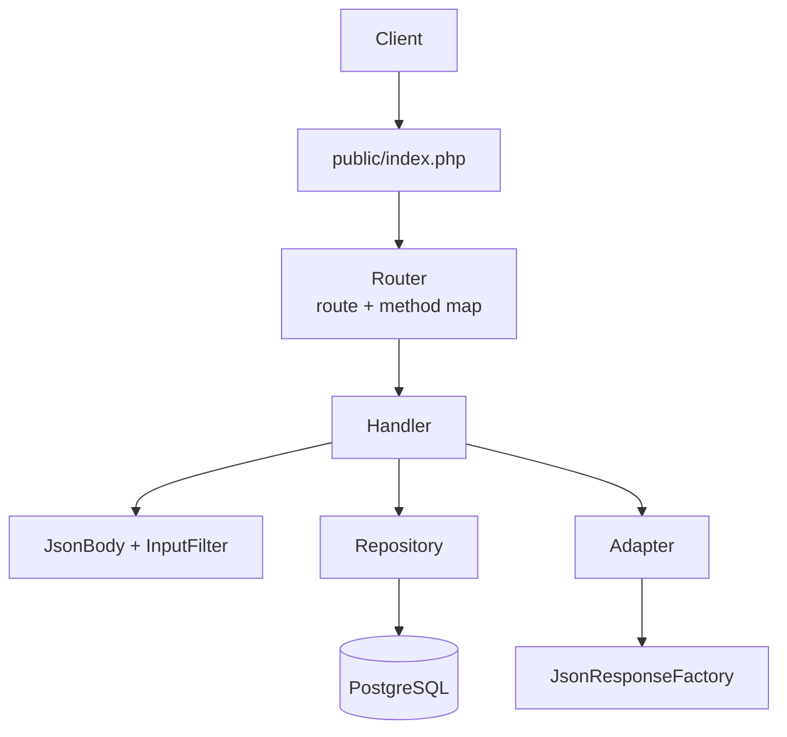

# laminas-api-sample

A learning project using PHP 8.5, Laminas and Doctrine: a small REST backend
modelled on a slice of the
[Path of Exile developer API](https://www.pathofexile.com/developer/docs/reference).

Whilst paths, response shapes and error codes all follow the published docs,
the application serves its own data and does not call GGG's API.

The app is hand-wired from Laminas components, rather than a full framework
or starter template. This way each part can be understood, explained, and
reasoned for. The commit history follows that progression.


## Features

- `GET /profile`, `GET|POST /item-filter`, `GET|POST /item-filter/{id}`, with
  documented response shapes
- Create and partial update with validation
- Documented error responses
- Doctrine entities, embeddables, and reviewed migrations
- PostgreSQL in Docker Compose, credentials in shared environment from `.env`
- Fixtures seeded from real data
- PHPUnit testing for entities, domain endpoints, input validation, adapters
  and the HTTP layer
- Written with adherence to modern PHP conventions using strict static analysis

> _*Auth is not implemented yet.* Every request is treated as already authorised
> with the scope the real API requires: `account:profile` for `/profile` and
> `account:item_filter` for `/item-filter`. The roadmap below covers future
> changes related to this._


## Roadmap

- GitHub Actions CI
- Nginx + php-fpm in Docker Compose
- Mocked OAuth bearer tokens with route scopes and ownership
- OpenAPI spec with Swagger UI
- Per-token rate limiting in Redis, with the documented headers

## How it works



## Build and run

Requires PHP 8.5 with `pdo_pgsql`, Composer and Docker.

```bash
git clone https://github.com/blakesimpson-dev/laminas-api-sample.git
cd laminas-api-sample
composer install
cp .env.example .env              # set DB_NAME, DB_USER, DB_PASSWORD
composer db:reset                 # docker compose: fresh Postgres + migrations
composer fixtures:load            # seed DB
composer serve                    # http://localhost:8080

curl localhost:8080/profile             # get account profile
curl localhost:8080/item-filter         # get a list of item filters
curl localhost:8080/item-filter/<id>    # get one item filter
```

| Script | Purpose |
|--------|---------|
| `composer serve` | PHP built-in server on port 8080 |
| `composer migrations:diff` / `migrations:migrate` | Doctrine Migrations |
| `composer fixtures:load` | Purge and reseed |
| `composer db:reset` | Recreate Postgres and migrate |
| `composer test` | Run the PHPUnit unit tests |

## Layout

| Path | Purpose |
|------|---------|
| `public/index.php` | Front controller |
| `bootstrap.php` | Autoload and validated `.env` |
| `docker-compose.yml` | PostgreSQL service (Nginx + php-fpm on the roadmap) |
| `config` | Routes, service manager, Doctrine |
| `src/Http` | Router, request parsing, responses |
| `src/Domains` | One folder per domain: entity, repository, adapter, handlers, validation, provider |
| `bin` | Migration and fixture runners |
| `migrations` | Doctrine migrations |
| `test/Fixtures` | Fixtures and filter files |

## Dependencies

| Dependency | Version | Licence |
|------------|---------|---------|
| laminas router, servicemanager, http | 3.19, 3.24, 2.23 | BSD-3-Clause |
| laminas inputfilter, validator | 2.35, 2.65 | BSD-3-Clause |
| doctrine orm, migrations, data-fixtures | 3.7, 3.9, 2.2 | MIT |
| roave/psr-container-doctrine | 6.2 | BSD-2-Clause |
| ramsey/uuid | 4.9 | MIT |
| vlucas/phpdotenv | 5.7 | BSD-3-Clause |
| PostgreSQL (Docker) | 17 | PostgreSQL |

## Credits

Item filter fixtures are
[NeverSink's filters](https://github.com/NeverSinkDev/NeverSink-Filter)
(MIT), exported from FilterBlade.

The application code is my own (MIT, see [LICENSE](LICENSE)). An LLM was used
for explanations and tooling configuration.

This project isn't affiliated with or endorsed by Grinding Gear Games in any
way.

## References

- [Path of Exile developer docs](https://www.pathofexile.com/developer/docs)
- [Laminas](https://docs.laminas.dev/),
  [mezzio-skeleton](https://github.com/mezzio/mezzio-skeleton)
- [Doctrine ORM](https://www.doctrine-project.org/projects/orm.html),
  [Migrations](https://www.doctrine-project.org/projects/migrations.html),
  [Data Fixtures](https://www.doctrine-project.org/projects/data-fixtures.html)
- [PER Coding Style](https://www.php-fig.org/per/coding-style/),
  [PSR-4](https://www.php-fig.org/psr/psr-4/)
- [Mago](https://mago.carthage.software/)
