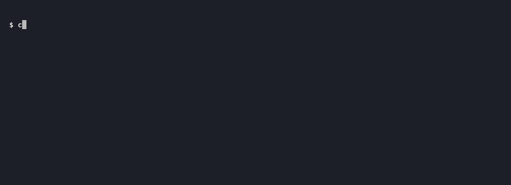
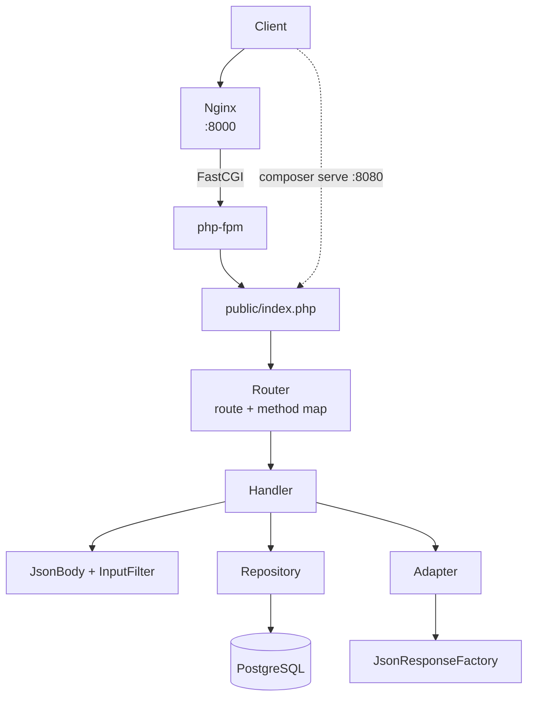

# laminas-api-sample


A learning project using PHP 8.5, Laminas and Doctrine: a small REST backend
modelled on a slice of the
[Path of Exile developer API](https://www.pathofexile.com/developer/docs/reference).

Whilst paths, response shapes and error codes all follow the published docs, the
application serves its own data and does not call GGG's API.

The app is hand-wired from Laminas components, rather than a full framework or
starter template. This way each part can be understood, explained, and reasoned
for. The commit history follows that progression.



## Features

- `GET /profile`, `GET|POST /item-filter`, `GET|POST /item-filter/{id}`, with
  documented response shapes
- Create and partial update with validation - actions are recorded as timestamps
  on each entity via an injected system clock
- Documented error responses
- Doctrine entities, embeddables, and reviewed migrations
- Nginx + php-fpm + PostgreSQL in Docker Compose, credentials in shared
  environment from `.env`
- Fixtures seeded from real data
- PHPUnit testing for entities, input validation, adapters and the HTTP layer
- Written with adherence to modern PHP conventions using strict static analysis

> _**Auth is not implemented yet.** Every request is treated as already
> authorised with the scope the real API requires: `account:profile` for
> `/profile` and `account:item_filter` for `/item-filter`._

## Roadmap

- Lightweight Vite + Vue 3 + TypeScript web client, with Pinia and SASS styling
- Mocked OAuth bearer tokens with route scopes and ownership
- OpenAPI spec with Swagger UI
- Per-token rate limiting in Redis, with the documented headers

## How it works



## Build and run

Requires Docker and Composer. PHP 8.5 with `pdo_pgsql` is needed locally for
Composer scripts, tests and `composer serve`.

```bash
git clone https://github.com/blakesimpson-dev/laminas-api-sample.git
cd laminas-api-sample
composer install
cp .env.example .env                    # local dev defaults, adjust if needed
composer reset                          # fresh Postgres + migrations
composer fixtures:load                  # seeding
```

### Run via Nginx (prod style)

```bash
composer up                             # build + start Postgres, php-fpm, Nginx
curl localhost:8000/profile
```

Nginx serves `public/`, passes `index.php` to php-fpm over FastCGI, and returns
404 for any other `.php` path. JSON responses are gzipped and headers are
sanitized (server and PHP versions are stripped).

### Run via built-in server

```bash
curl localhost:8080/profile             # get account profile
curl localhost:8080/item-filter         # get a list of item filters
curl localhost:8080/item-filter/<id>    # get one item filter
```

Both can run at the same time against the same database.

```bash
curl localhost:8000/profile             # get account profile
curl localhost:8000/item-filter         # get a list of item filters
curl localhost:8000/item-filter/<id>    # get one item filter
```

| Script                                            | Purpose                                                 |
| ------------------------------------------------- | ------------------------------------------------------- |
| `composer serve`                                  | PHP built-in server on port 8080                        |
| `composer migrations:diff` / `migrations:migrate` | Doctrine Migrations                                     |
| `composer fixtures:load`                          | Purge and reseed                                        |
| `composer reset`                                  | Recreate Postgres and migrate                           |
| `composer test`                                   | Run the PHPUnit unit tests                              |
| `composer up`                                     | Build and start Postgres, php-fpm and Nginx (port 8000) |
| `composer down`                                   | Stop the Docker services, volume is kept                |
| `composer lint` / `analyze`                       | Mago linter and static analyzer (fail on warnings)      |
| `composer format` / `format:check`                | Mago formatter (PER-CS based)                           |

## Layout

| Path                 | Purpose                                                                  |
| -------------------- | ------------------------------------------------------------------------ |
| `config`             | Routes, service manager, Doctrine                                        |
| `src/Http`           | Router, JSON body parsing, error responses                               |
| `src/Domains`        | One folder per domain: entity, repository, adapter, handlers, validation |
| `src/Infrastructure` | Doctrine entity manager factory, system clock                            |
| `docker`             | php-fpm image and Nginx site config                                      |
| `migrations`         | Reviewed Doctrine migrations                                             |
| `test`               | Unit tests, fixtures and fixture data                                    |

## Credits

Item filter fixtures are
[NeverSink's filters](https://github.com/NeverSinkDev/NeverSink-Filter) (MIT),
exported from FilterBlade.

The application code is my own (MIT, see [LICENSE](LICENSE)). An LLM was used
for explanations and tooling configuration.

This project isn't affiliated with or endorsed by Grinding Gear Games in any
way.

## References

- [Path of Exile developer docs](https://www.pathofexile.com/developer/docs)
- [Laminas](https://docs.laminas.dev/)
- [Doctrine ORM](https://www.doctrine-project.org/projects/orm.html),
  [Migrations](https://www.doctrine-project.org/projects/migrations.html),
  [Data Fixtures](https://www.doctrine-project.org/projects/data-fixtures.html)
- [Mago](https://mago.carthage.software/)
