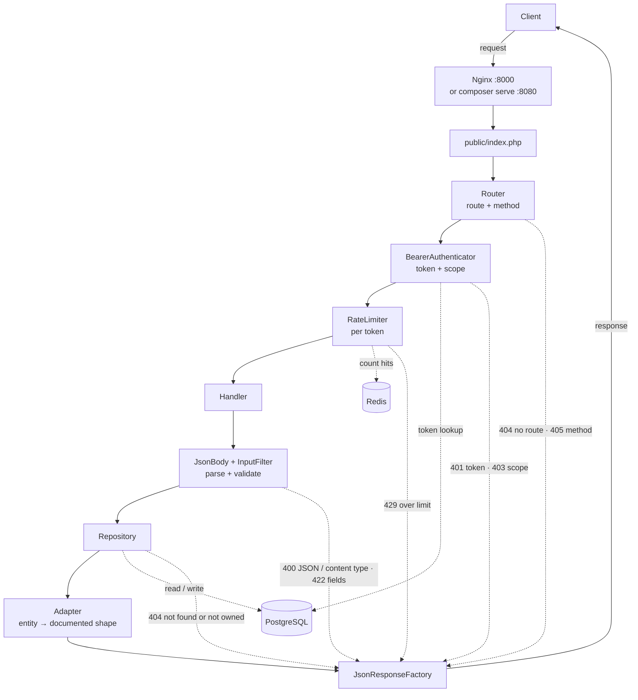

# laminas-api-sample

[](https://github.com/blakesimpson-dev/laminas-api-sample/actions/workflows/ci.yml)


[](LICENSE)

A small REST backend in PHP 8.5, Laminas and Doctrine, replicating a slice of
the
[Path of Exile developer API](https://www.pathofexile.com/developer/docs/reference).
Paths, response shapes, error codes, auth and rate limiting follow the published
docs. Data remains local, however, and GGG's API is not called.

It has been hand-wired from Laminas components, rather than go full-framework,
so that every part can be explained. The commit history follows that
progression.


## Features

- **Endpoints:**
  [`/profile`](https://www.pathofexile.com/developer/docs/reference#profile-get)
  and
  [`/item-filter`](https://www.pathofexile.com/developer/docs/reference#itemfilters)
  (read-many, read, create, partial update), with the documented
  [response shapes](https://www.pathofexile.com/developer/docs/reference#type-ItemFilter)
  and [error codes](https://www.pathofexile.com/developer/docs/index#errors)
- **Auth:** mocked OAuth 2.1 bearer tokens with per-route scopes, expiry,
  revocation and per-profile ownership ([details](#auth))
- **Rate limiting:** per token in Redis, with the documented headers and 429
  responses ([details](#rate-limiting))
- **API docs:** hand-written OpenAPI 3.1 spec with Swagger UI; a contract test
  keeps it in step with the code ([details](#api-docs))
- **Persistence:** Doctrine entities and embeddables, reviewed migrations,
  created/updated timestamps from an injected clock, fixtures seeded from real
  item filters
- **Stack:** Nginx, php-fpm, PostgreSQL, Redis and Swagger UI in Docker Compose
- **Quality:** PHPUnit unit and contract tests; Mago formatting, linting and
  strict static analysis, all enforced in CI

## Auth

Replicates the resource server (`api.pathofexile.com`) only. Token issuance
(`www.pathofexile.com/oauth`) is out of scope: dev tokens are seeded as if the
authorization server had issued them, and stored as SHA-256 hashes. As in the
[real API](https://www.pathofexile.com/developer/docs/authorization#request),
the token identifies its owner, so `account:*` endpoints need no id in the path.

| Endpoint                                                | [Scope](https://www.pathofexile.com/developer/docs/authorization#scopes-accounts) |
| ------------------------------------------------------- | --------------------------------------------------------------------------------- |
| `GET /profile`                                          | `account:profile`                                                                 |
| `GET\|POST /item-filter`, `GET\|POST /item-filter/{id}` | `account:item_filter`                                                             |

| Dev token                 | Demonstrates                                  |
| ------------------------- | --------------------------------------------- |
| `dev-token-full`          | full access, as `ProfileOne`                  |
| `dev-token-profile-only`  | 403 (code 6) on `/item-filter`: missing scope |
| `dev-token-expired`       | 401 (code 8): expired                         |
| `dev-token-revoked`       | 401 (code 8): revoked                         |
| `dev-token-other-profile` | `ProfileTwo`: `ProfileOne`'s filters are 404  |

401 and 403 responses carry `WWW-Authenticate`
([RFC 6750](https://datatracker.ietf.org/doc/html/rfc6750#section-3)). Another
profile's filter is a 404, not a 403, so its existence isn't revealed.

## Rate limiting

Follows the documented
[rate-limit headers](https://www.pathofexile.com/developer/docs/index#ratelimits),
with one policy (`api`) and one rule (`client`): 10 requests per 5 s per token,
then restricted for 10 s. Every authorised response reports the state; over the
limit it's `429 Too Many Requests` with `Retry-After` and error code 3.

```http
X-Rate-Limit-Policy: api
X-Rate-Limit-Rules: client
X-Rate-Limit-Client: 10:5:10          # <max hits>:<period s>:<restricted s>
X-Rate-Limit-Client-State: 1:5:0      # <hits>:<period s>:<active restriction s>
```

The limiter runs after authentication, so 401 and 403 carry no rate-limit
headers. If Redis is down, requests fail closed with a 500 (code 4).

## How it works


```mermaid
flowchart TD
C[Client] -->|request| N[Nginx :8000<br/>or composer serve :8080]
N  --> I[public/index.php]
I  --> R[Router<br/>route + method]
R  --> Au[BearerAuthenticator<br/>token + scope]
Au --> RL[RateLimiter<br/>per token]
RL --> H[Handler]
H  --> V[JsonBody + InputFilter<br/>parse + validate]
V  --> Rp[Repository]
Rp --> A[Adapter<br/>entity → documented shape]
A  --> J[JsonResponseFactory]
J  -->|response| C

Au -.->|token lookup| D[(PostgreSQL)]
Rp -.->|read / write| D
RL -.->|count hits| RD[(Redis)]

R  -. "404 no route · 405 method" .-> J
Au -. "401 token · 403 scope" .-> J
RL -. "429 over limit" .-> J
V  -. "400 JSON / content type · 422 fields" .-> J
Rp -. "404 not found or not owned" .-> J
```

Dotted exits are the request-level errors. Server-side failures (500, 501) and
every response per endpoint are in the [API docs](#api-docs).

## Build and run

Requires Docker and Composer, plus PHP 8.5 with `pdo_pgsql` locally for the
Composer scripts, tests and `composer serve`.

```bash
git clone https://github.com/blakesimpson-dev/laminas-api-sample.git
cd laminas-api-sample
composer install
cp .env.example .env        # local dev defaults
composer reset              # fresh Postgres + migrations
composer fixtures:load      # seed data and dev tokens
composer up                 # Postgres, Redis, php-fpm, Nginx, Swagger UI

export AUTH='Authorization: Bearer dev-token-full'
curl -H "$AUTH" localhost:8000/profile
curl -H "$AUTH" localhost:8000/item-filter
curl -H "$AUTH" localhost:8000/item-filter/<id>
```

- **Nginx (:8000)** serves `public/`, passes only `index.php` to php-fpm (any
  other `.php` path is a 404), gzips JSON and hides server and PHP versions.
- **`composer serve` (:8080)** is the quick local alternative; both can run
  against the same database.

## API docs

`docs/openapi.json` is the contract, written by hand 😭 Open Swagger UI at
<http://localhost:8000/docs>, click **Authorize**, paste a dev token, then **Try
it out**. It's same-origin with the API, so there's no CORS.

- **Spec first:** a contract test fails if an adapter adds or drops a key the
  spec doesn't match, in either direction.
- **Scopes:** OpenAPI can't attach scopes to bearer auth, so each operation
  states its scope in its description and `x-required-scope`.
- **Lint:**
  `docker run --rm -v "$PWD/docs:/spec" redocly/cli lint /spec/openapi.json`

## Scripts

| Script                                  | Purpose                                          |
| --------------------------------------- | ------------------------------------------------ |
| `composer up` / `down`                  | Start (building images) / stop the Docker stack  |
| `composer serve`                        | PHP built-in server on :8080                     |
| `composer reset`                        | Recreate Postgres and run migrations             |
| `composer fixtures:load`                | Purge and reseed                                 |
| `composer migrations:diff` / `:migrate` | Generate / apply Doctrine migrations             |
| `composer test`                         | PHPUnit unit and contract tests                  |
| `composer lint` / `analyze`             | Mago linter / static analyzer (fail on warnings) |
| `composer format` / `format:check`      | Mago formatter (PER-CS based)                    |

## Layout

| Path                 | Contents                                                      |
| -------------------- | ------------------------------------------------------------- |
| `config`             | Routes, service manager, Doctrine                             |
| `src/Domains`        | Per domain: entity, repository, adapter, handlers, validation |
| `src/Http`           | Router, auth, rate limiting, JSON parsing, responses          |
| `src/Infrastructure` | Doctrine, clock, Redis store, migration tooling               |
| `docker`             | php-fpm image, Nginx site config                              |
| `docs`               | OpenAPI spec, README demo                                     |
| `migrations`         | Reviewed Doctrine migrations                                  |
| `test`               | Unit and contract tests, fixtures                             |

## Credits

Item filter fixtures are
[NeverSink's filters](https://github.com/NeverSinkDev/NeverSink-Filter) (MIT),
exported from FilterBlade. The application code is my own (MIT, see
[LICENSE](LICENSE)); an LLM was used for explanations and tooling configuration.
Not affiliated with or endorsed by Grinding Gear Games.

## References

- Path of Exile developer docs:
  [API reference](https://www.pathofexile.com/developer/docs/reference),
  [authorization](https://www.pathofexile.com/developer/docs/authorization),
  [errors and rate limits](https://www.pathofexile.com/developer/docs/index#errors),
  [item filter format](https://www.pathofexile.com/developer/docs/game#itemfilters)
- [Laminas](https://docs.laminas.dev/),
  [Doctrine ORM](https://www.doctrine-project.org/projects/orm.html),
  [Migrations](https://www.doctrine-project.org/projects/migrations.html),
  [Data Fixtures](https://www.doctrine-project.org/projects/data-fixtures.html)
- [OpenAPI 3.1](https://spec.openapis.org/oas/v3.1.0),
  [Swagger UI](https://swagger.io/tools/swagger-ui/),
  [Redocly CLI](https://redocly.com/docs/cli/)
- [Mago](https://mago.carthage.software/)
